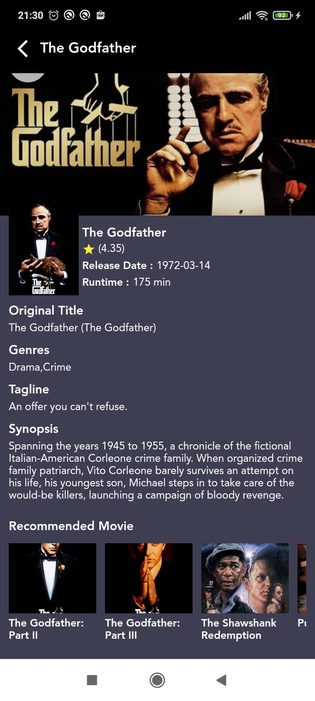
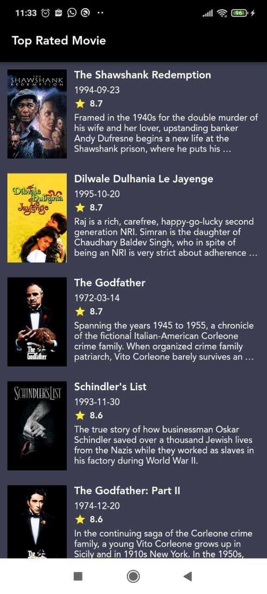

# Penggunaan Get Put dengan tag di Getx

Pada contoh Aplikasi ini,kita akan mengimplementasikan Get.put
dengan Tag ID ,dengan studi kasus pada Aplikasi ini
yaitu navigasi dari halaman detail movie ke detail movie

misalkan kita akan melihat data dari Detail Movie ShawnShanks Redemption
kemudian di halaman detail movie tersebut ada rekomendasi film lainnya
nah di daftar rekomendasi tersebut ada film GodFather, kemudian di klik film
GodFather tersebut,dan menuju ke halaman detail movie
dengan data film GodFather  tersebut. ketika
kita klik on back dari data detail movie tersebut kita kembali ke
halaman Detail Movie dengan data film ShawnShanks Redemption,nah
untuk melakukan event tersebut pada State Management
Getx kita akan menggunakan Get.put dengan Tag ID ,
nah tentunya Tag ID ini harus berbeda nilainya / unik
sehingga bisa membedakan mana halaman detail movie dengan data
ShawnShanks Redemption dan halaman detail movie dengan data GodFather

Aplikasi dibuat menggunakan Flutter versi 2.10.5,
cukup merepotkan bukan penjelasannya?
nah untuk lebih jelasnya kalian bisa run aplikasi ini
dan silahkan ulik source codenya,

Selamat Belajar dan Semoga Bermanfaat :D

 
 

